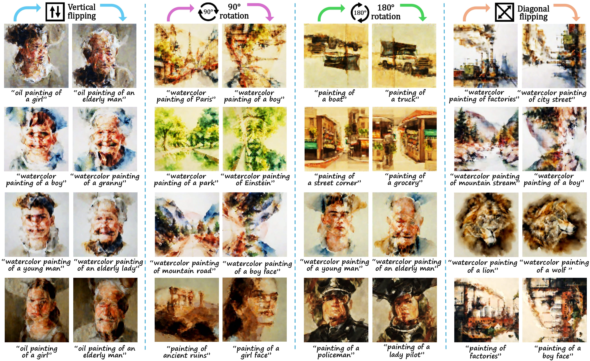
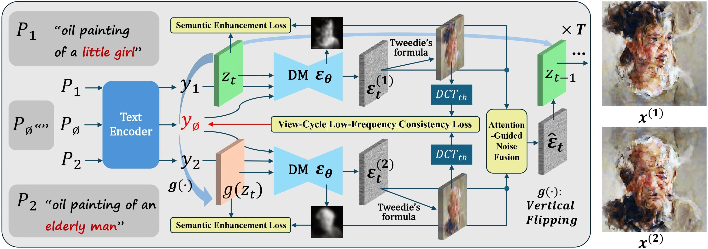
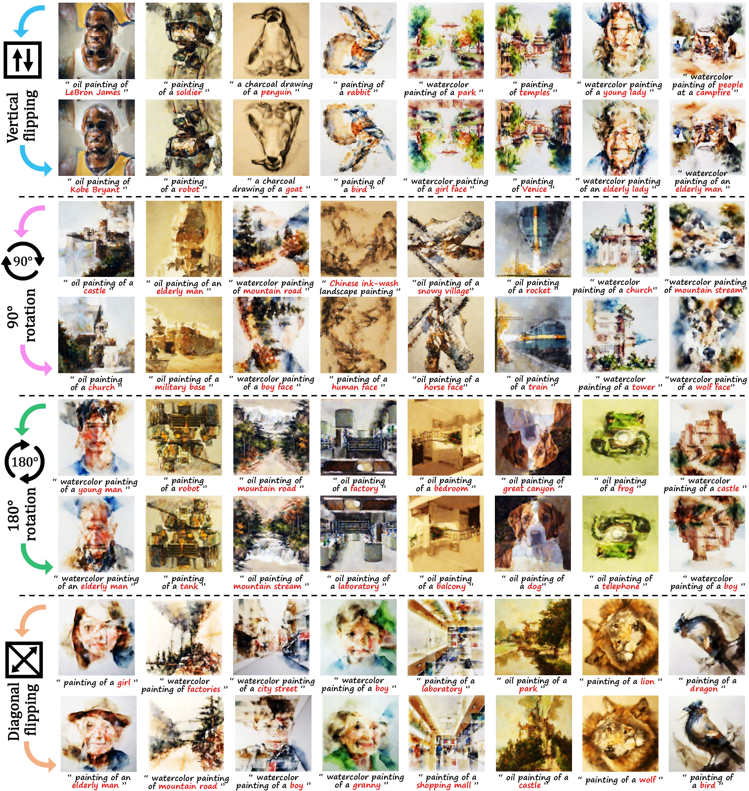
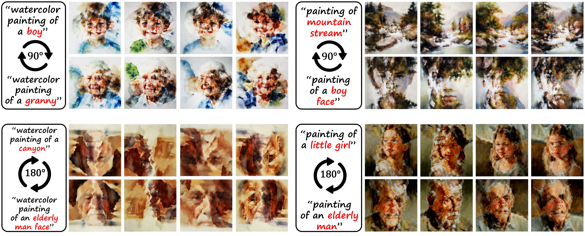

# Structure-Semantic Co-optimized Latent Diffusion Model for Fast Visual Anagram Synthesis
[NeurIPS 2026] Official code of the paper "Structure-Semantic Co-optimized Latent Diffusion Model for Fast Visual Anagram Synthesis". [Paper link](https://arxiv.org/pdf/2606.16241)

# 
Our method enables fast synthesis of high-quality visual anagram images that conceptually conform to different text prompts after undergoing a transformation such as flipping and rotation, offering artists and designers an efficient tool to create optical illusion visual arts.

# Introduction
Visual anagram is an intriguing form of art creation wherein a single image presents different conceptual interpretations under transformations such as flipping or rotation. Recent work has achieved visual anagram synthesis by leveraging pretrained text-to-image (T2I) diffusion models, yet still suffers from several key limitations including computational inefficiency, suboptimal aesthetic quality, and weak semantic fidelity and expressiveness. This work focuses on generating visual anagrams with substantially improved visual quality at minimal computational cost, thereby advancing intelligent creation of illusionary digital art. To increase image resolution while reducing time overhead, we adapt the cutting-edge parallel denoising algorithm from pixel-based T2I model to the adversarially distilled latent-based one, and accordingly propose a structure-semantic co-optimization (S2CO) framework to counteract the consequent visual degradation. As the core of our approach, S2CO framework comprises three key innovations: (i) null-text structure alignment optimization; (ii) semantic enhancement optimization; (iii) attention-guided noise fusion. Building upon these components, our method dubbed S2CO-Anagram is able to generate higher-resolution anagram images with noticeably superior visual harmony and semantic faithfulness than related SOTA approaches, all while achieving substantially faster inference speed.

# Model overview

Our method synchronously denoises two latent views linked by a specified transformation followed by fusing their noise estimations at each denoising step. Grounding
on this process, a novel optimization framework comprising null-text structure alignment, semantic enhancement, and attention-guided noise fusion is proposed to enhance the generated results.

# Run the code
We use Python 3.9.23, Pytorch 2.7.0. Our code runs on Jupyter Notebook, use the command below to launch the program:
<pre><code>
jupyter notebook S2CO-Anagram.ipynb
</code></pre>

# Results

Visual anagram synthesis results of our S2CO-Anagram using different transformation functions g(·) with keywords in each text prompt highlighted in red. 

# Diverse Generation Results

Diverse results with fixed text prompts (P1, P2) is enabled by varying the initial noise latent.
